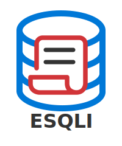

# ESQLI
**An easy-to-use SQL interface built with Python (PyQt5)**

ESQLI is an open-source, lightweight GUI for exploring, querying, and managing SQL databases.  
It provides an intuitive visual interface with editable table previews, query tabs, and database management dialogs.



---

## ✨ Features
- 🖥️ **Modern PyQt5 GUI** — organized panels for queries, data previews, and table design  
- 🗃️ **Supports multiple database engines** (e.g. SQL Server Express, MySQL, SQLite)  
- ✏️ **Editable data preview** with inline updates and row addition  
- 📜 **SQL query editor** with syntax highlighting, autocomplete, and multi-tab support  
- 📚 **Common SQL queries dialog** for quick templates  
- 📦 **Data import/export** (CSV, JSON, and SQL)  
- 🧰 **Modular architecture** — easily extendable via `core/`, `db/`, and `gui/` modules  
- 🌍 **Cross-platform** — runs on Windows, macOS, and Linux  

---

## 🚀 Getting Started

### Prerequisites

Before running ESQLI, make sure you have:
- **Python 3.8+** — [Download here](https://www.python.org/downloads/)  
  (✅ Add Python to your PATH during installation)
- **Git** — [Download Git](https://git-scm.com/downloads)

---

### 1. Clone the repository
```bash
git clone https://github.com/tonasj/esqli.git
cd esqli
````

### 2. (Optional) Create a virtual environment

```bash
python -m venv .venv
```

Activate it:

**Windows PowerShell**

```bash
.\.venv\Scripts\Activate.ps1
```

**macOS/Linux**

```bash
source .venv/bin/activate
```

To deactivate:

```bash
deactivate
```

---

### 3. Install dependencies

```bash
pip install -r requirements.txt
```

This installs all required libraries including **PyQt5**, **pytest**, and **pytest-qt**.

---

## ▶️ Running the Application

To start ESQLI:

```bash
python run_esqli.py
```

Once launched, you can:

* Connect to a database engine (e.g. MSSQL Server Express, MySQL (planned))
* Browse databases and tables
* Open new SQL query tabs
* Execute queries and view results interactively

---

## 🧱 Project Structure

```
ESQLI/
├── core/                    # Core utilities (e.g. file utils, config)
├── db/                      # Database helpers and SQL query constants
├── gui/
│   ├── connection_window/    # Connection and engine dialogs
│   ├── database_explorer/    # Tree, query editor, data preview panels
│   ├── other_windows/        # Dialogs like AddRow and CommonQueries
│   └── gui_helpers/          # Shared PyQt widgets and helpers
├── tests/                    # Pytest + pytest-qt test suite
│   └── sql_tests.py
└── run_esqli.py              # Application entry point
```

---

## 🧑‍💻 Development Notes

* All GUI components use **PyQt5** with modular signal-slot design.
* Database operations are abstracted via `controller` and `db_utils` modules.
* Tests run in headless mode using `pytest-qt`, so **no actual database connection** is required.
* The project follows consistent **PEP8** and **docstring** conventions.

---

## 💬 Contributing

Contributions are welcome!
To contribute:

1. Fork the repo
2. Create a feature branch (`git checkout -b feature/my-feature`)
3. Commit your changes
4. Submit a pull request

---

## 🧑‍🎨 Author

**Tomas Huikko**
GitHub: [@tonasj](https://github.com/tonasj)